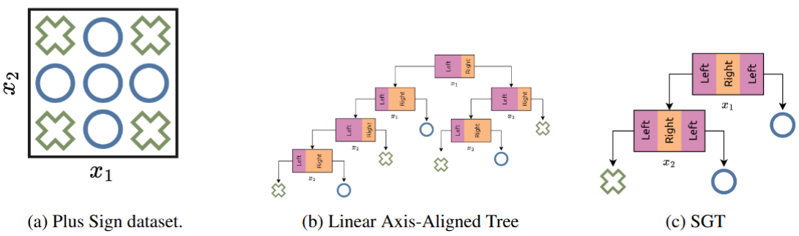

# Empowering Decision Trees via Shape Functions (NeurIPS 2025)

This the working repository for the paper "[Empowering Decision Trees via Shape Functions](https://arxiv.org/abs/2510.19040)" (NeurIPS 2025). 


## What's New?

- 🌳 **Shape Generalized Trees (SGTs):** A new class of decision trees where each node applies a learnable, axis-aligned *shape function* to a feature, enabling non-linear and interpretable splits.  
- 👁 **Interpretability:** Each node’s shape function can be directly visualized, providing intuitive, visual explanations of the model’s decision process.  
- ⚡ **ShapeCART Algorithm:** An efficient induction method for learning SGTs from data.  
- 🔀 **Extensions:**  
  - **Shape²GT (S²GT):** Bivariate shape functions for richer splits.  
  - **SGT<sub>K</sub>:** Multi-way branching generalization.  
  - **Shape²CART & ShapeCART<sub>K</sub>:** Algorithms for learning S²GTs and SGT<sub>K</sub>s.  
  - ShapeCART extensions for both variants. 

## Setup

Before running our code, please make sure you have the required packages installed. You can do this by running:

```bash
conda env create -f environment.yml
conda activate EmpViaShapes
```

## Demo
Example usage is in the following or available in `demo.ipynb`. This notebook provides examples on how to train SGTs and their variants (SGT₃, S²GT, S²GT₃). Additionally, see `src/ShapeCARTClassifier.py` and `src/BranchingTree.py` for source code of our approach. 

## Citation
If you find this code useful in your research, please consider citing our paper:


Additionally, check out our other works on our [lab website.](https://optimal.mie.utoronto.ca/)
